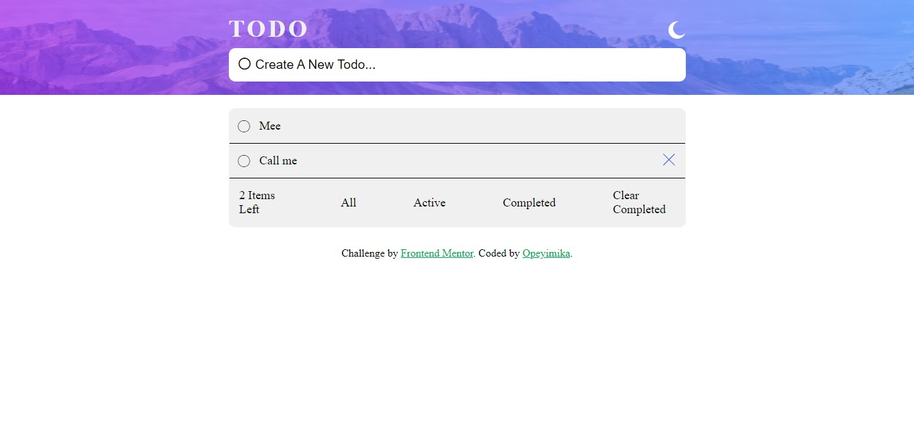

# Todo app 

I built a Todo list app seen on Frontend Mentor. Below you'd find details about the project.

## Overview
The To-do List is one of the most common applications recommended to beginners to get their feet wet when they are familiar with HTML, CSS and JS. It got my shoes soaked rather. It was really intense and I am glad I was headstrong about seeing it through because my knowledge of JS fundamentals are all the better for it.

### The challenge

Users should be able to:

- View the optimal layout for the app depending on their device's screen size
- See hover states for all interactive elements on the page
- Add new todos to the list
- Mark todos as complete
- Delete todos from the list
- Filter by all/active/complete todos
- Clear all completed todos
- Toggle light and dark mode
 while depending largely on localStorage such that if the user came back days, weeks or months after adding todo items to the website, they'd be able to see tasks ticked as completed, those undone and filter to their heart's content.

### Screenshot

;

### Links

- Solution URL: 
- Live Site URL: 

## My process

### Built with

- Semantic HTML5 markup
- CSS custom properties
- Flexbox
- Media Queries
- Local Storage
- Callback Functions
- Javascript Array Methods
- Google Material Icons

### What I learned

I learnt so much about how to think up logic. In previous Javascript projects, I approached writing code on a test-run basis - Let's see if it'd work type-of-vibe. This project was different, I wrote down specifically on paper what the next steps were after successfully adding a functionality or simply getting an element or class from the index.html page. After that, I wrote the test cases that the algorithm I wrote needed to pass to ensure that my algorithm didn't only pass the logic needed to build this functionality but also for additional functionalities. 

I also understood localStorage well from building this project. I had never heard of localStorage or sessionStorage. All I knew of were cookies but this project helped me really understand localStorage, how to set items in it, how to get the items in it using the key and then updating it as you remove a todo item, for example.

I also understood callback functions. The simplest callback function I made was one that turned the filter(active, completed) I clicked blue after 1 second but turned it back to black after 10 seconds with the setTimeout() function.

### Continued development

I plan to learn JSON with the next project I build. I saw a little bit of what it could do with JSON.stringify and JSON.parse but I'd like to see what more can be built using JSON.

### Useful resources

- [Freecodecamp article on localStorage](https://www.freecodecamp.org/news/how-to-store-data-in-web-browser-storage-localstorage-and-session-storage-explained/) - This helped me understand localStorage.
- [Ania Kubow's video on Callback Function](https://www.youtube.com/watch?v=cNjIUSDnb9k&t=532s) - This is an amazing video which helped me finally understand Callback Functions. I'd recommend it to anyone still learning this concept.

## Author

- Website - [Opeyimika](https://github.com/Opeyimika-sudo/)
- Twitter - [@LifeOfOpeyimika](https://twitter.com/LifeOfOpeyimika)
